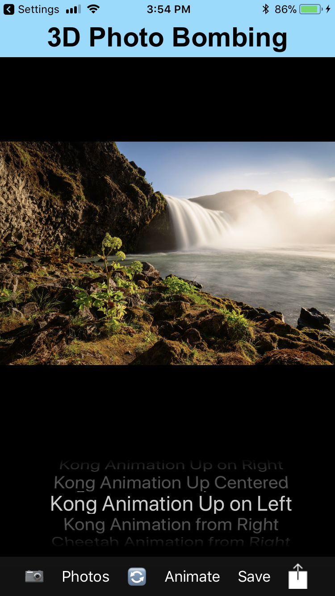
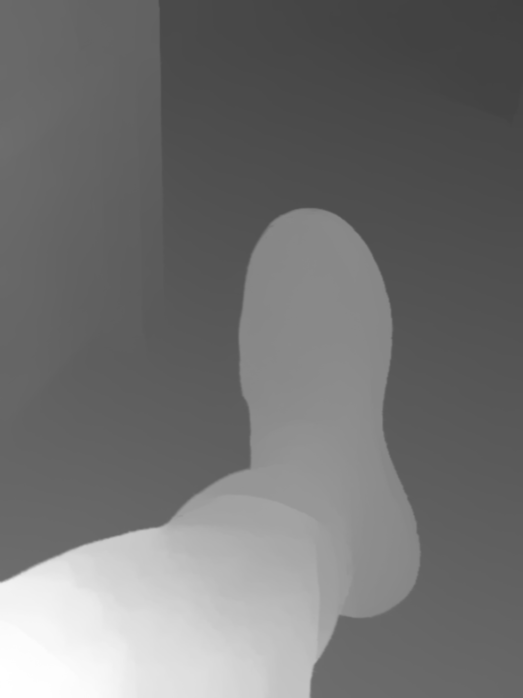

# 3D Photo Bombing
- This app's current 3D features are in development and has yet to be moved to a public github.

## App Design and Vision

- App is targeted for social media photo exchange by adding animation with true 3D features to pictures.  This current app is a framework for a larger vision to use real 3D effects using augmented reality, which is unique compared to the current apps that supply photo enhancing by just overlaying animation over a photo. That is, I expect to use in the next version depth data for pictures to mask animation putting them in 3D planes, thus having a full 3D affect with animations going behind the most forward planes/graphics. Version 2.0.0 will have this implemented prior to App Store submission. Apple ARKit may be used but dual camera iPhones are the most promising to supply the Depth Data Mask.

#### Bob Whitehead's Bio

[Bio](http://wampage.com/BobBio)

- Main view
# 

- 3D Picture - example
# 

- Depth Data (Mask) - example
# 

#### Example Movie

[Sample video](3DPhotoBombing/renderedMovie.mp4)

12/11/2017
